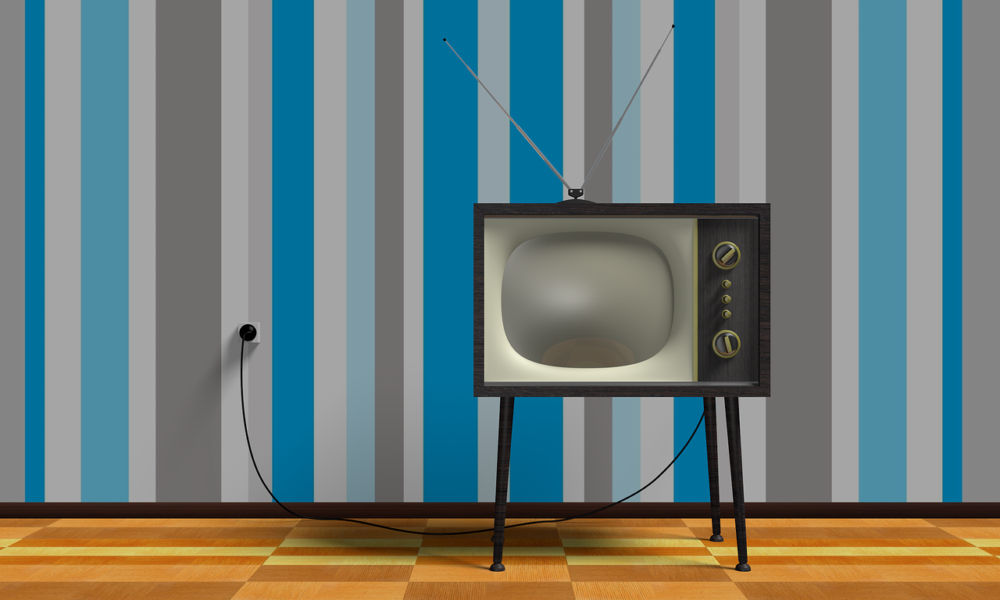

# Juego de Ping Pong en Python

## Documentación del Código

### Descripción

Este proyecto consiste en la implementación de un juego de ping pong clásico en Python, desarrollado sin el uso de bibliotecas externas. El juego se ejecuta en la terminal de Linux y permite a dos jugadores controlar paletas para golpear una bola y marcar puntos.

### Estructura del Código

El juego está implementado en un bucle principal que maneja la lógica del juego y la interacción con el usuario a través de la terminal. A continuación, se describen las principales funciones y su funcionalidad:

### Funciones Principales

- **`print_board()`**: Esta función se encarga de imprimir el tablero del juego en la terminal, mostrando la posición de la bola, las paletas de los jugadores y los bordes del tablero en color verde.

- **`move_ball()`**: Gestiona el movimiento de la bola en el tablero. Verifica las colisiones con las paletas de los jugadores y los bordes del tablero, actualizando la dirección de la bola y marcando puntos cuando la bola atraviesa las defensas de los jugadores.

- **`reset_game()`**: Reinicia el juego, restableciendo los puntajes y las posiciones iniciales de las paletas y la bola.

- **`move_paddle()`**: Permite que los jugadores muevan sus paletas hacia arriba o hacia abajo en respuesta a las teclas presionadas por los usuarios.

- **`get_key()`**: Captura las teclas presionadas por el usuario para controlar las paletas y gestionar la reinicialización del juego.

### Componentes del Juego

El juego utiliza variables globales para almacenar el estado del juego, incluyendo la posición de la bola, las posiciones de las paletas de los jugadores y los puntajes. La interacción con el usuario se realiza mediante la captura de teclas para mover las paletas y controlar el reinicio del juego.

### 1. Importación de Módulos

El juego utiliza los siguientes módulos estándar de Python:

- **`os`**: Para operaciones del sistema operativo, utilizado para limpiar la pantalla (`clear_screen()`).
- **`time`**: Para pausar la ejecución del programa y controlar el tiempo de espera entre movimientos (`time.sleep()`).
- **`sys`**: Para interactuar con parámetros y funciones específicas del sistema, utilizado para la captura de teclas (`sys.stdin.read()`).
- **`termios` y `tty`**: Para configurar el modo de terminal y capturar teclas de manera directa (`termios.tcgetattr()`, `tty.setraw()`, `termios.tcsetattr()`).

Además, se utiliza el módulo externo `chime` para generar efectos de sonido cuando la bola golpea las paletas y cuando un jugador gana.

### 2. Configuración Inicial

#### Variables Globales:

- **`WIDTH` y `HEIGHT`**: Define las dimensiones del tablero de juego en caracteres.
- **`ball_pos` y `ball_dir`**: Almacena la posición y la dirección de la bola en el tablero.
- **`paddle1_pos` y `paddle2_pos`**: Almacena las posiciones verticales de las paletas de los jugadores A y B.
- **`PADDLE_SIZE`**: Define la altura de las paletas.
- **`score_a` y `score_b`**: Almacena los puntajes de los jugadores A y B.
- **`WINNING_SCORE`**: Define el puntaje necesario para que un jugador gane la partida.

#### Colores ANSI:

- **`GREEN` y `RESET`**: Define códigos ANSI para imprimir texto en color verde y restablecer el color de la terminal, respectivamente.

### 3. Funciones de Utilidad

#### `clear_screen()`

Utiliza el comando `os.system('clear')` para limpiar la pantalla de la terminal y actualizar el tablero de juego.

#### `print_board()`

Imprime el estado actual del tablero de juego en la terminal, incluyendo las posiciones de la bola y las paletas de los jugadores, así como los bordes del tablero en color verde.

#### `move_ball()`

Controla el movimiento de la bola en el tablero, gestionando las colisiones con las paletas de los jugadores y los bordes del tablero. Actualiza las posiciones de la bola y marca puntos cuando un jugador no logra golpear la bola con su paleta.

#### `reset_ball()`

Restablece la posición inicial de la bola al centro del tablero y reinicia su dirección.

#### `reset_game()`

Restablece todos los valores del juego a sus configuraciones iniciales, incluyendo puntajes y posiciones de las paletas y la bola.

#### `move_paddle(paddle, direction)`

Permite que los jugadores muevan sus paletas hacia arriba o hacia abajo en respuesta a las teclas presionadas por los usuarios. `paddle` indica qué jugador está moviendo su paleta, y `direction` define la dirección del movimiento.

#### `get_key()`

Captura la tecla presionada por el usuario para controlar las paletas de los jugadores y gestionar la reinicialización del juego.

#### `check_winner()`

Verifica si alguno de los jugadores ha alcanzado el puntaje de victoria (`WINNING_SCORE`). En caso afirmativo, imprime un mensaje de victoria y maneja las acciones para reiniciar el juego o salir del programa.

#### `play_sound_hit()` y `play_sound_win()`

Estas funciones utilizan el módulo `chime` para reproducir sonidos cuando la bola golpea una paleta (`play_sound_hit()`) y cuando un jugador gana la partida (`play_sound_win()`).

### 4. Bucle Principal

El bucle principal del juego controla la ejecución continua del juego hasta que se cumplan ciertas condiciones, como la victoria de un jugador o la finalización del programa por parte del usuario mediante la tecla `Esc`.

Durante cada iteración del bucle, se actualiza el tablero, se manejan los movimientos de la bola y las paletas de los jugadores según las teclas presionadas por el usuario, y se verifica si hay un ganador. El juego se pausa brevemente entre cada iteración para una experiencia de juego más fluida.

---

### Ejecución y Uso

Para ejecutar el juego, simplemente se ejecuta el script en Python desde la línea de comandos en una terminal de Linux. Los jugadores utilizan las teclas `w`, `s` para el jugador A y `i`, `k` para el jugador B, respectivamente, para mover sus paletas. Se muestra el puntaje actualizado en la parte superior central del tablero.

Este proyecto no utiliza bibliotecas externas, demostrando el uso de programación pura en Python para implementar un juego funcional y entretenido de ping pong.

## Enfoque de Programación Utilizado
## Lógica de Programación y Paradigma de Programación

### ¿Qué es la Lógica de Programación?

**Lógica de programación** se refiere al proceso de diseñar y desarrollar algoritmos para resolver problemas utilizando un lenguaje de programación específico. Implica la aplicación de principios de razonamiento lógico y matemático para estructurar y organizar instrucciones que serán ejecutadas por un computador.

En términos prácticos, la lógica de programación implica:

- **Análisis de Problemas:** Comprender y definir claramente el problema que se va a resolver mediante programación.
- **Diseño de Algoritmos:** Desarrollar una serie de pasos y decisiones lógicas que, cuando se ejecutan en orden, resuelven el problema de manera efectiva y eficiente.
- **Implementación en Código:** Traducir el algoritmo diseñado a un lenguaje de programación específico, utilizando la sintaxis y las estructuras de dicho lenguaje.

La lógica de programación se centra en la organización y la secuencia lógica de las instrucciones, asegurando que el programa funcione correctamente y produzca los resultados esperados.

### ¿Qué es un Paradigma de Programación?

**Paradigma de programación** se refiere a un enfoque o estilo particular para la escritura de programas de computadora, que define la forma en que se estructuran, organizan y ejecutan las instrucciones del código. Cada paradigma tiene sus propios principios, reglas y técnicas para resolver problemas mediante software.

Algunos de los paradigmas de programación más comunes incluyen:

1. **Programación Procedural:** Se centra en la secuencia de instrucciones que se ejecutan en orden, utilizando funciones y procedimientos para modularizar y organizar el código de manera estructurada.
   
2. **Programación Orientada a Objetos (POO):** Organiza el código alrededor de objetos que encapsulan datos y métodos relacionados, facilitando la reutilización, el mantenimiento y la modularidad del código.
   
3. **Programación Funcional:** Se basa en funciones puras que operan sobre datos inmutables, evitando el estado compartido y los efectos secundarios. Se centra en la composición de funciones y la aplicación de transformaciones sobre datos.

4. **Programación Declarativa:** Especifica el qué debe hacerse en lugar del cómo, utilizando declaraciones y expresiones para definir el problema sin detallar la secuencia exacta de pasos.

Cada paradigma ofrece ventajas y desventajas dependiendo del tipo de problema que se esté abordando y de las preferencias del desarrollador en términos de claridad, mantenibilidad y eficiencia del código.

### Relación entre Lógica y Paradigma de Programación

La lógica de programación proporciona los principios fundamentales para diseñar algoritmos eficientes y efectivos, independientemente del paradigma de programación utilizado. Por otro lado, el paradigma de programación define cómo se implementan y estructuran esos algoritmos en un lenguaje de programación específico, influenciando la forma en que se organiza el código y se gestionan los datos.

En resumen, la lógica de programación es esencial para diseñar soluciones algorítmicas, mientras que el paradigma de programación proporciona el marco y las herramientas para implementar esas soluciones de manera efectiva en un entorno de desarrollo de software.

### ¿Qué es un Paradigma en Programación?

Un paradigma de programación es un conjunto de principios y métodos que guían la forma en que se diseña y estructura el código de un programa. Define cómo se organizan las instrucciones y los datos, así como las técnicas para resolver problemas mediante software.

### Paradigma de Programación

El enfoque principal utilizado en este proyecto es la programación procedural e imperativa. Esto significa que el código está estructurado en torno a funciones que ejecutan pasos secuenciales para controlar el flujo del juego y manipular el estado del mismo directamente.

## Lógica de Programación

### Diferencias frente a la Programación Funcional

#### a. Mutabilidad de Estado

En la programación procedural utilizada en este juego, el estado del programa se gestiona a través de variables globales y locales que pueden cambiar de estado durante la ejecución. Por ejemplo, las posiciones de la bola y las paletas de los jugadores (`ball_pos`, `paddle1_pos`, `paddle2_pos`) se actualizan directamente en respuesta a eventos como el movimiento del jugador o el impacto de la bola. Esta mutabilidad permite un control detallado y directo del estado del juego en tiempo real, pero también puede llevar a complicaciones cuando se gestionan múltiples estados o se requiere una lógica más compleja para garantizar la consistencia.

En contraste, en la programación funcional, se promueve el uso de funciones puras que no tienen efectos secundarios y operan solo sobre datos inmutables. Esto facilita la comprensión del código y reduce los errores relacionados con cambios inadvertidos en el estado del programa, favoreciendo un diseño más predecible y seguro en aplicaciones donde la mutabilidad del estado es un riesgo.

#### b. Estructuras de Control

La programación procedural se basa en estructuras de control como bucles (`while`, `for`) y condicionales (`if`, `else`) para dirigir el flujo de ejecución del programa. En el juego de ping pong, estas estructuras se utilizan para manejar eventos como el movimiento de las paletas, la detección de colisiones y la gestión de puntajes. Esto proporciona un control preciso y secuencial sobre cómo se actualiza y cambia el estado del juego en función de las acciones de los jugadores y la lógica del juego.

Por otro lado, en la programación funcional, se utilizan estructuras de control más declarativas y funcionales como `map`, `filter`, y `reduce`, junto con la recursividad, para transformar y manipular datos de manera más abstracta y matemática. Esto permite una mayor expresividad y abstracción en ciertos tipos de problemas, aunque puede requerir un cambio de mentalidad y una curva de aprendizaje para programadores acostumbrados a estructuras de control imperativas.

#### c. Paradigma de Programación

El paradigma principal utilizado en este proyecto es la programación procedural, que se centra en la secuencia de instrucciones y el control explícito del estado del programa a través de funciones y variables. Esto permite una implementación directa y controlada del juego, adecuada para aplicaciones donde el control detallado del flujo de ejecución y la gestión del estado son fundamentales para la interacción del usuario y la lógica del juego.

En contraste, la programación funcional se centra en la composición de funciones y la aplicación de transformaciones sobre datos inmutables, priorizando la claridad, la concisión y la minimización de efectos secundarios. Es más adecuada para problemas donde la inmutabilidad del estado y la composición funcional ofrecen ventajas en términos de mantenibilidad y depuración del código.

#### d. Reutilización de Código

En la programación procedural, la reutilización de código se logra principalmente mediante la encapsulación de lógica en funciones y procedimientos. Por ejemplo, las funciones `move_ball()`, `move_paddle()`, y `reset_game()` encapsulan diferentes aspectos de la lógica del juego, permitiendo su uso repetido y modular en diferentes partes del programa. Esto facilita la organización del código y la gestión de la complejidad al dividir el problema en partes más pequeñas y manejables.

En la programación funcional, la reutilización de código se fomenta mediante funciones puras y composición funcional. Las funciones son tratadas como unidades independientes de lógica que pueden combinarse y reutilizarse fácilmente para diferentes propósitos, promoviendo la modularidad y la flexibilidad en el diseño del programa.

---

Estas diferencias destacan cómo la elección del paradigma de programación afecta la estructura, el diseño y la mantenibilidad del código en aplicaciones como el juego de ping pong implementado en Python. ¿Hay algo más que te gustaría añadir o ajustar en esta sección?

### ¿Qué es Programación Funcional?

La programación funcional es un paradigma en el que los programas se construyen principalmente mediante funciones puras y evitan el estado mutable y los efectos secundarios. Se centra en la aplicación de funciones sobre datos inmutables y la composición de funciones para resolver problemas.

## Diferenciación entre Otros Paradigmas

### Programación Procedural vs. Programación Orientada a Objetos

Este proyecto se diferencia de la programación orientada a objetos (POO) en que no utiliza la encapsulación de datos ni la herencia de comportamientos. En su lugar, utiliza funciones y variables globales para controlar el estado del juego de manera directa.

### Programación Procedural vs. Programación Funcional

A diferencia de la programación funcional, que se centra en la aplicación de funciones sobre datos inmutables y la composición de funciones para resolver problemas, la programación procedural aquí adoptada se basa en el control explícito del flujo de ejecución y la modificación de variables globales para gestionar el estado del juego.

---
> [!TIP]
>   Si quieres contribuir al proyecto, puedes ayudar de las siguientes maneras:
> - Reportando problemas o sugiriendo nuevas características mediante issues.
> - Mejorando la documentación para hacerla más clara y comprensible.
> - Aportando código mediante pull requests para resolver problemas o añadir características.

## Contribuir al Proyecto

¡Gracias por considerar contribuir al proyecto! Puedes ayudar de las siguientes maneras:

> [!CAUTION]
> Reto: Problema de Reproducción de Sonido
>Actualmente, estamos enfrentando un problema con la reproducción de sonidos en el juego. Aunque hemos intentado usar varias técnicas, los sonidos a veces no se reproducen correctamente o se eliminan al refrescar la pantalla.
>Si tienes experiencia en manejo de audio en entornos de terminal con Python, ¡tu ayuda será muy apreciada!

---

© 2024 Sparveriusdev 

